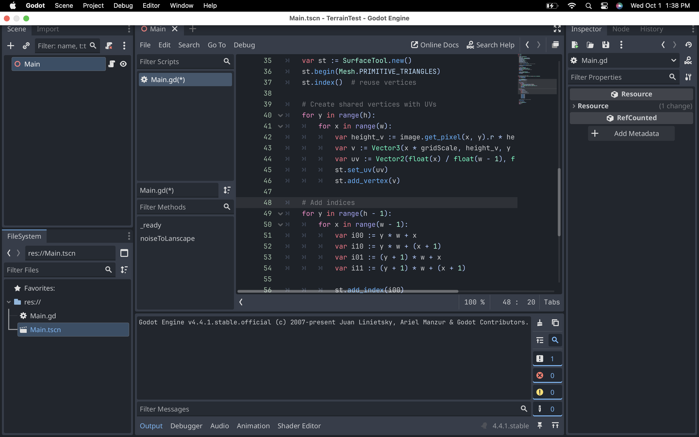
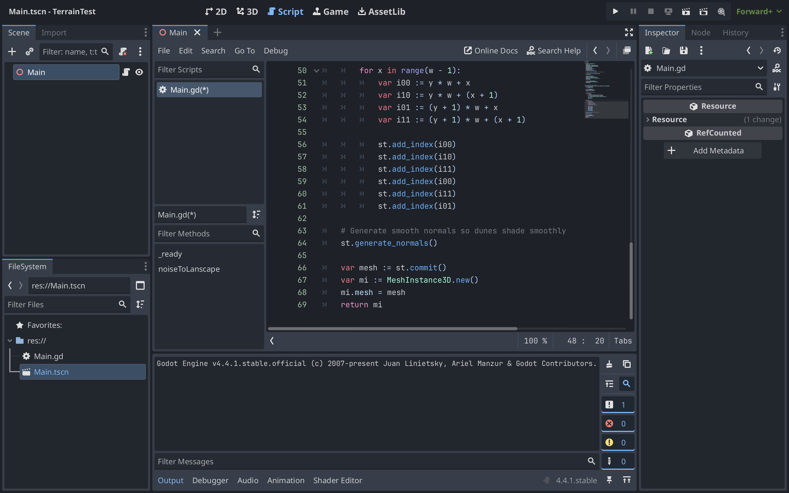

COMP 360 ON1 Assignments

## Assignment 1: 3D Landscape
*If you've contributed something since this file was last updated, please add yourself in!*

#### Generate 3D landscape
- Sun Pak
- Aniket Sandhu
- William Craske
#### Generate 2D texture
- Sho Okano
- William Craske
- Fahim Ar-Rashid
#### Record debugging/testing demo videos
- Sho Okano, [Initial 2D Texture Creation](https://youtu.be/Hb5TNBVI_qE)
- William Craske, [2D fix and 3D base Creation](https://www.youtube.com/watch?v=Jn8QvWzMxn8)
- Sunny Pak, https://github.com/360-g5/assignments/wiki/How-Sunny-Approached-This
- Aniket Sandhu,
  The terrain looked blocky because each triangle was created with its own vertices, so lighting couldn’t blend across them.  

I fixed this by:
- Adding `st.index()` so vertices are shared between triangles.
- Using `st.generate_normals()` so normals are averaged for smooth shading.

  
  

#### Review pull requests
- Pragti
  Tested and reviewed the PR from the group. Fixed some minor bugs
#### Update project documentation (README.md, kanban board)
- Sho Okano
- William Craske
- Aniket Sandhu
#### Update discord documentation (meeting minutes, assignment clarifications, helpful tools) 
- Sho Okano
- Fahim Ar-Rashid
- Aniket Sandhu
